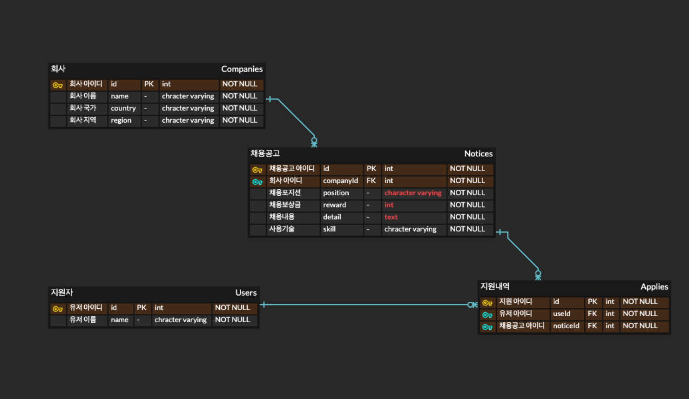
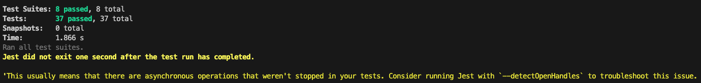

# wanted-pre-boarding-backend 선발과제_박준익

## 목차
[1. 요구사항 분석](#요구사항-분석)<br/>
[2. 프로젝트 설명(구현 과정)](#프로젝트-설명)<br/>
[3. 프로젝트 설치&실행방법](#프로젝트-설치--실행-방법)<br/>
[4. 유닛 테스트](#유닛-테스트)<br/>
[5. 문제 및 해결](#문제-및-해결)

## 요구사항 분석

### 서비스 개요
- 기업의 채용을 위한 서비스
- 회사는 채용공고를 생성하고, 사용자가 지원할 수 있음

### 기능 분석

1. 채용공고 등록
    - 생성한 회사의 id와 함께 채용공고를 등록함(회사id, 포지션, 보상, 내용, 기술)
    - 회사가 생성돼있어야 함(id, 회사이름, 국가, 지역)
2. 채용공고 수정
    - 등록되어있는 채용공고의 id를 통해 데이터를 수정
3. 채용공고 삭제
    - 등록되어있는 채용공고의 id를 통해 데이터 삭제
4. 채용공고 목록 조회
    - 현재 등록되어있는 모든 채용공고 목록 조회
    - 회사명, 국가, 지역이 포함돼야 함
5. 채용공고 검색 기능
    - keyword를 통해 해당 keyword를 포함한 채용공고를 가져옴
6. 채용 상세 페이지 조회
    - 채용공고 id를 통해 해당 채용공고의 상세내용을 조회
    - 해당 채용공고를 올린 회사가 다른 채용공고도 함께 반환
7. 채용공고 지원
    - 사용자는 1회만 한 채용공고에 지원가능(사용자id, 채용공고id)
    - 사용자가 생성돼있어야 함(이름)

## 프로젝트 설명

### 개발 환경
- 사용언어 : `Javascript`
- 프레임워크 : `node.js`
- 데이터베이스 : `Postgresql`
- ORM : `sequelize`
- IDE : `vscode`

### ERD

- 관계
  - 회사(1):채용공고(N) 관계 설정
  - 유저(1):지원내역(N) 관계 설정
  - 채용공고(1):지원내역(N) 관계 설정

### API 명세서
|index|method|URL|body|description|
|------|---|---|---|---|
|1|POST|/company|{<br/>&nbsp;"id":int,<br/>&nbsp;"name":string,<br/>&nbsp;"country":string,<br/>&nbsp;"region":string<br/>}|회사생성|
|2|POST|/notice|{<br/>&nbsp;"companyId":int,<br/>&nbsp;"position":string,<br/>&nbsp;"reward":int,<br/>&nbsp;"detail":string<br/>&nbsp;"skill":string<br/>}|채용공고생성|
|3|PUT|/notice/:id|{<br/>&nbsp;"position":string,<br/>&nbsp;"reward":int,<br/>&nbsp;"detail":string<br/>&nbsp;"skill":string<br/>}|채용공고 수정<br/>회사id는 포함해서 요청해도 업데이트되지않음, 변경하고자 하는 data만 포함시켜서 보내도 변경됨|
|4|DELETE|/notice/:id|-|채용공고 삭제
|5|GET|/notice|-|채용공고 목록 전체 조회
|6|GET|/notice?search=keyword|-|채용공고 검색<br/>keyword에 찾고자하는 정보 입력
|7|GET|/notice/:id|-|채용공고 상세 조회<br/>회사가 올린 다른 채용공고도 함께 확인 가능
|8|POST|/user|{<br/>&nbsp;"id":int,<br/>&nbsp;"name":string<br/>}|유저 생성
|9|POST|/apply|{<br/>&nbsp;"user_id":int,<br/>&nbsp;"notice_id":int<br/>}|채용공고에 지원<br/>중복지원 or 없는 채용공고id or 없는 사용자id일 경우 에러 발생

### 상세 구현 과정
1. 개발환경 구축
2. db설정 및 연결 확인
3. 테이블 생성 및 관계 설정(sequelize 이용), 마이그레이션 실행
4. 필요한 폴더 및 파일 생성
    - 폴더 : models, controllers, routes 생성
    - 파일 : 각 테이블 별 model, controller, route 생성
5. 기능 구현
    - 각 파일에 요구기능 구현
    1. model 파일에 필드 정의
    2. controller 파일에 각 기능별 함수 작성
    3. route 파일에 API 경로 정의
6. postman을 이용해 구현 기능 확인
7. unit test 구현(jest, supertest)
8. README 파일 작성


## 프로젝트 설치 & 실행 방법
### 프로젝트 클론
```
git clone https://github.com/cod2048/wanted-pre-onboarding-backend.git
```
### 의존성 패키지 설치
```
npm install
```
### 환경 설정
- 프로젝트 루트 경로에 `.env`파일 생성 후 아래내용 입력(본인 db에 맞는 내용으로 입력)
```
DB_USERNAME=유저이름
DB_PASSWORD=비밀번호
DB_DATABASE=데이터베이스이름
DB_HOST=localhost
DB_DIALECT=postgres
```
**- postgresql이 없다면 설치 후 db를 실행 및 생성해주세요.**
### 데이터베이스 마이그레이션
```
npx sequelize-cli db:migrate
```

### 서버 실행
```
npm start
```

## 유닛 테스트
### 실행 방법
```
npm test
```
테스트 실행 전 데이터베이스의 데이터를 모두 삭제하길 권장합니다.
### 테스트별 상세 설명
총 8개 파일 / 37개 test
- 회사 생성(01-companyCreate.test.js)
  - 올바른 회사데이터일 경우 : statusCode(201)
  - 필수 데이터가 누락 된 회사데이터일 경우 : statusCode(500)
- 채용공고 생성(02-noticeCreate.test.js)
  - 올바른 채용공고데이터일 경우 : statusCode(201)
  - 필수 데이터가 누락 된 채용공고데이터 test : statusCode(500)
- 채용공고 수정(03-noticeUpdate.test.js)
  - 데이터 수정 성공 시 : statusCode(200)
  - 없는 채용공고 업데이트 시도 시 : statusCode(404)
- 채용공고 삭제(04-noticeDelete.test.js)
  - 데이터 삭제 성공 시 : statusCode(204)
  - 없는 채용공고 삭제 시도 시 : statusCode(404)
- 채용공고 조회(05-noticeGet.test.js)
  - 조회 성공 시 : statusCode(200)
- 채용공고 검색 및 상세페이지 조회(06-noticeSearch.test.js)
  - 검색 성공 시 : statusCode(200)
  - 존재하는 채용 상세페이지 조회 시 : statusCode(200)
  - 존재하지 않는 채용 상세페이지 조회 시 : statusCode(404)
- 유저 생성(06-user.test.js)
  - 올바른 유저데이터일 경우 : statusCode(201)
  - 필수 데이터가 누락된 유저데이터일 경우 : statusCode(500)
- 채용공고 지원(07-apply.test.js)
  - 올바른 지원 시 : statusCode(201)
  - 중복지원시 : statusCode(403)
  - 없는 채용공고에 지원시 : statusCode(500)
  - 없는 유저아이디로 지원시 : statusCode(500)
### 테스트 실행 결과



## 문제 및 해결
1. 테이블 별 id 생성 방식<br/>
&nbsp;&nbsp;&nbsp;&nbsp;&nbsp;&nbsp;&nbsp;**문제**
    - 처음에는 4개의 테이블 모두 id를 자동생성 후 다음 데이터는 1씩 증가하도록 설정
    - 회사와 유저가 본인의 id를 모를 수도 있는 상황 가정</br>
    **해결**
    - company와 user는 사용자가 직접 id를 지정할 수 있도록 변경
    - 채용공고와 지원내역은 id를 자동생성하고 회사와 유저는 생성 시 id값을 받되, 중복이 불가능하도록 설정
2. 검색 기능 test<br/>
&nbsp;&nbsp;&nbsp;&nbsp;&nbsp;&nbsp;&nbsp;**문제**
    - 검색 키워드를 '원티드'로 설정 후 , postman을 이용한 결과는 정상적으로 반환됨
    - 유닛 테스트에 .get('/notice?search=원티드');로 코드를 작성 후 실행을 하니 기대값과 다른 값 반환</br>
    **해결**
    - 전송할 때의 인코딩 방식을 맞춰주기 위해 코드를 `.get('/notice?search=' + encodeURIComponent('원티드'));`로 변경해서 해결
3. 데이터 삭제 시 id값 초기화<br/>
&nbsp;&nbsp;&nbsp;&nbsp;&nbsp;&nbsp;&nbsp;**문제**
    - 테스트 케이스 실행 종료 후 `await table명.destroy({ where: {}, truncate: true, restartIdentity: true });`을 코드에 작성해도 id가 1로 초기화 되지 않음
    - 여러 문서와 stackoverflow를 참고한 결과, `restartIdentity`가 제대로 작동하지 않는다는 문제 발견<br/>
    **해결**
    - postgresql의 쿼리문을 직접 코드에 작성해서 `await sequelize.query('ALTER SEQUENCE "table명_id_seq" RESTART WITH 1');` 해당 문제를 해결